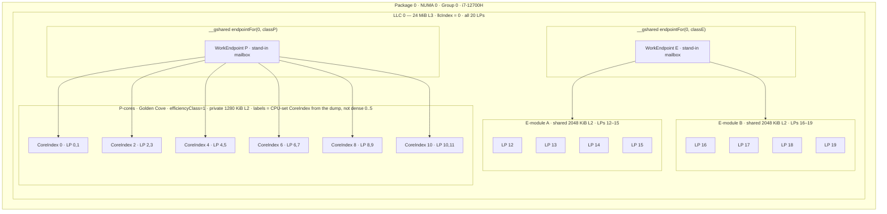

# Cache-Topology-Aware Thread Pool (D)

| Field | Value |
| --- | --- |
| **Title** | Cache-topology-aware thread pool for D |
| **Author** | (library owner) |
| **Date** | 2026-08-19 |
| **Status** | Draft (ready to implement) |
| **License** | BSL-1.0 (Boost Software License 1.0) |
| **Package** | `threadpool` (dub), implementation root `D:\proj\grok\threadpool` |
| **v1 target** | Windows x64, Intel hybrid (Alder Lake-H i7-12700H). Reference SKU: ProductName "Windows 10 Home", DisplayVersion 25H2, ReleaseId 2009 (frozen), CurrentBuild 26200, UBR 9168 |
| **v1 non-target** | Linux (module boundary + `Error` stub only) |
| **Compilers** | DMD64 v2.112.1, LDC 1.42.0 (frontend v2.112.1); public API compiler-agnostic |

---

## Overview

D's `std.parallelism.TaskPool` and the Windows thread pool (`CreateThreadpool`) both treat the machine as a bag of logical processors. That is the wrong model on a 12th-gen Intel hybrid CPU and on any AMD CCD / multi-socket system: last-level cache (LLC / L3) is the coherence and capacity boundary that work should not casually cross, and on Intel hybrid the P-core vs E-core split is an orthogonal axis that dominates latency and QoS even when there is only one L3.

This library discovers the OS topology once, materializes an immutable snapshot, pins workers for life to a single logical processor via Windows CPU Sets (not `SetThreadAffinityMask`), tags them HighQoS or EcoQoS, and runs **separate** P-core and E-core loops so the idle/wait path is not a per-iteration hybrid branch. Each worker is a **locator**: it calls a user `WorkerBody` that finds caller-owned `C` via `home!C()` / `at!C()` (Ant Farm or anything else). This package does **not** implement a production concurrent queue. Idle policy is a single-owner **Director** (spin / sleep / sleepUntil / wait / signal) with LLC, P/E, and label filters.

On the reference machine (SISYPHUS, i7-12700H) there is **one L3 domain covering all 20 logical processors**, so "don't touch other L3s" is vacuously true here. The P/E split is the load-bearing locality story on this box. The LLC axis stays first-class: `llcIndex` is a **process-wide dense id** clustered on `(processor group, LastLevelCacheIndex)` and confirmed by RelationCache Level=3 masks, so two sockets that both report group-relative `LastLevelCacheIndex == 0` do **not** alias onto one mailbox.

---

## Background & Motivation

### Current state

`D:\proj\grok` has no existing D sources, no dub package, and no `threadpool` directory. This is a greenfield library to be created at `D:\proj\grok\threadpool`.

Phobos `std.parallelism.TaskPool` (`C:\D\dmd2\src\phobos\std\parallelism.d`) is one `queueMutex` plus an intrusive linked list of **private** `AbstractTask` nodes (`head`/`tail`); tasks may live on the stack or the GC heap. Workers are not pinned and not cache-aware. Druntime `core.sys.windows` (DMD 2.112.1) declares `SetThreadAffinityMask` but **does not** declare `GetLogicalProcessorInformationEx`, `GetSystemCpuSetInformation`, `SetThreadSelectedCpuSets`, `GROUP_AFFINITY`, `WaitOnAddress`, or `THREAD_POWER_THROTTLING_STATE`. The library must ship its own `extern (Windows)` bindings.

### Pain points this design addresses

1. **No cache map.** Callers cannot ask how cores sit on L3 domains or which LPs are P vs E.
2. **Hybrid mismatch.** A latency-sensitive task that lands on a Gracemont E-core sees a different pipeline, no SMT, a shared 2 MiB L2, and (on Windows 11) possible Eco-class parking. Conversely, background work on a Golden Cove P-core wastes the wide OoO core and can displace interactive work.
3. **Affinity that the OS may ignore on hybrid Win11.** CPU Sets plus `ThreadPowerThrottling` are the supported contract. On this host, hard affinity generally still sticks, but CPU Sets remain the v1 pin path (groups, parking cooperation, and Win11 Thread Director).
4. **One homogeneous worker loop.** `TaskPool` does not specialize wait/spin for Golden Cove vs Gracemont, and does not pin a worker to an LLC-local, class-local endpoint.

### Reference hardware (instantiation, not a special case)

The design is general. This machine is the first concrete instantiation and the live-test oracle.

| Item | Value |
| --- | --- |
| CPU | 12th Gen Intel Core i7-12700H (Alder Lake-H), Family 6 Model 154 Stepping 3, CPUID `BFEBFBFF000906A3` |
| Package / NUMA / group | 1 / 1 / 1 |
| Logical processors | 20 |
| P-cores | 6 × Golden Cove, SMT=yes, Windows `EfficiencyClass=1`, LPs 0–11, pairs (0,1)…(10,11) |
| P-core caches | 48 KiB L1D / 32 KiB L1I / **1280 KiB private L2** |
| E-cores | 8 × Gracemont, SMT=no, `EfficiencyClass=0`, LPs 12–19 |
| E-core L2 | two ProcessorModules, **2048 KiB shared L2** each (LPs 12–15 and 16–19) |
| E-core L1 | 32 KiB L1D / 64 KiB L1I |
| L3 | **one** 24 MiB unified 12-way LLC, 64 B lines, `LastLevelCacheIndex=0` for every CPU set |
| OS | ProductName Windows 10 Home, hostname SISYPHUS. Registry: DisplayVersion **25H2**, ReleaseId **2009** (frozen from 20H2 onward), CurrentBuild **26200**, UBR **9168**. Record these in `tests/captured/README.txt`. |

`GetSystemCpuSetInformation` reports `llc=0` for every set. A strictly L3-sharded pool therefore degenerates to one domain here; class-local **endpoints** inside that domain are what actually separate P and E traffic. Dual-socket / two-group machines are tested with a **hand-built blob in PR 1**, not by hoping this laptop grows a second L3.

---

## Goals & Non-Goals

### Goals (v1)

- Discover Windows topology via `GetSystemCpuSetInformation` + `GetLogicalProcessorInformationEx` and expose an immutable snapshot: LP, core, SMT, L2 cluster / module, **LLC**, NUMA, package, group, efficiency class, cache sizes and line size.
- User-facing query: how logical/physical cores map to L3 domains, and which LPs are P vs E.
- Separate P-core and E-core worker loops (two functions, not one loop with a class branch). Each loop only touches the endpoint for its `(llcIndex, classIndex)` table slot.
- Pin each worker to one logical processor with CPU Sets; `ThreadPowerThrottling` ExecutionSpeed off on P, on on E (Win11 name: EcoQoS).
- Pool lifetime: start, stop, drain-or-drop, join; one live pool at a time; restart after join is allowed; empty selected-LP set fails `start()`.
- A user **worker body** (`bool function(WorkerSelf*)`) that locates `C` and push/pulls. `true` retries immediately; `false` applies director idle policy.
- A single-owner **Director** to set per-worker idle policy (spin, sleep, sleepUntil, wait) filtered by LLC, P/E, and tags. `wakeAll` is non-owning.
- Compile with both DMD and LDC on Windows. LDC may use `ldc.attributes` internally; the public API must not.
- Linux: types compile from **PR 1** (`topology.discover` / later `start` throw `Error` in the `else` branch). No silent mis-pin. `linux_topology.d` is only a later file move.
- Tests that parse a captured topology blob (machine-independent) plus a gated live test for i7-12700H (map + one dummy job per class).

### Non-goals (v1)

- **Any production concurrent queue.** No MPMC ring, no Chase-Lev, no sequence-number cells, no steal protocol. Work lives in caller-owned `C` installed with `bins`. Ant Farm is one such `C`; this package does not import it.
- A full Linux implementation (`sysfs` + `sched_setaffinity` + `cpu_capacity`).
- NUMA-aware allocation of application data (we only pin threads and address endpoints by LLC).
- Nested task graphs; cancellation tokens; work stealing.
- Replacing `std.parallelism` or providing parallel algorithms (`map`/`reduce`).
- macOS, ARM, 32-bit Windows, multiple process groups as a product feature (code must still *parse* groups).
- JIT / `ldc.dynamic_compile`, auto-vectorized kernels, or per-task SIMD targeting.
- Guaranteeing real-time latency or inventing a userspace scheduler that fights the kernel.

---

## Proposed Design

### Package layout

All paths under `D:\proj\grok\threadpool`.

```
threadpool/
  dub.sdl
  .gitignore
  source/
    threadpool/
      package.d              // public API barrel: re-export types + CacheAwarePool
      topology.d             // snapshot types, query API, lazy discover()
      pool.d                 // CacheAwarePool, PoolOptions, Director, shutdown
      worker.d               // thread start/stop/join, dispatch to loops
      hybrid.d               // WorkerSelf, WorkerBody, pCoreWorkerLoop / eCoreWorkerLoop
      pin.d                  // CPU Sets + QoS + self-pin
      stats.d                // parks/spins/executed (no steal counters in v1)
      sys/
        win_bindings.d       // version(Windows): structs + GetProcAddress
        win_topology.d       // version(Windows): discovery
        win_wait.d           // version(Windows): WaitOnAddress fallback Event
        linux_topology.d     // version(linux): signatures + Error stub
  tests/
    captured/
      README.txt             // how the blobs were produced; CurrentBuild 26200 / UBR 9168
      sisyphus_cpusets.bin   // raw GetSystemCpuSetInformation buffer
      sisyphus_slpiex.bin    // raw GetLogicalProcessorInformationEx(RelationAll)
    topology_parse.d         // SISYPHUS blobs + hand-built two-group / two-LLC fixture
    live_sisyphus.d          // explicit main; dub run -c live-test
```

**Module names** match directories: `threadpool`, `threadpool.topology`, `threadpool.endpoint` (the swap-out seam), `threadpool.sys.win_bindings`, etc. The real queue project is **not** imported; when it exists, it replaces `threadpool.endpoint` (same `WorkEndpoint` / `endpointFor` surface), it does not become a new dependency of the hybrid loops.

**`dub.sdl` (recommended over JSON):**

```sdl
name "threadpool"
description "Cache-topology-aware thread pool"
authors "library owner"
license "BSL-1.0"
targetType "library"
targetPath "bin"
sourcePaths "source"
importPaths "source"

toolchainRequirements {
    dmd ">=2.112.0"
    ldc ">=1.42.0"
}

configuration "library" {
    targetType "library"
}

// Default `dub test`: injects -unittest + a generated main.
// topology_parse.d must contain unittest blocks only — no `main`.
configuration "unittest" {
    targetType "executable"
    sourceFiles "tests/topology_parse.d"
}

// Live hardware binary: `dub run -c live-test` (not `dub test`).
// live_sisyphus.d provides `main`. Do not also compile it under unittest.
configuration "live-test" {
    targetType "executable"
    versions "threadpool_live_sisyphus"
    sourceFiles "tests/live_sisyphus.d"
}

platform "windows" {
    libs "kernel32"
}
```

WaitOnAddress is resolved at runtime (see `win_wait.d`): `GetProcAddress` on `kernel32.dll`, then `KernelBase.dll`, then `api-ms-win-core-synch-l1-2-0.dll`, then `LoadLibraryW("synchronization.dll")`. If all miss, use the Event fallback. Do **not** link `synchronization.lib`. Do **not** assume the export lives in `kernel32` on every 20H2-class image.

**Version split:**

| Identifier | Role |
| --- | --- |
| `version(Windows)` | bindings, discovery, wait, pin |
| `version(linux)` | stub that compiles and throws |
| `version(LDC)` | optional `@target("arch=alderlake")` / `@optStrategy("optsize")` on E-loop only |
| `version(threadpool_live_sisyphus)` | live hardware test |
| `debug(threadpool)` | topology dump and wait-path `printf` |

No `version(Sisyphus)` in library code. The i7-12700H is a test fixture, not a compile-time architecture.

### Topology model

Discovery runs once (pool start, or first `topology()` query) and then the snapshot is **immutable**. Workers and submitters only read it. Mutation after publish is a bug.

```d
module threadpool.topology;

enum CacheKind : ubyte { l1d, l1i, l2, l3, other }

struct CacheInfo
{
    CacheKind kind;
    ubyte     level;          // 1, 2, 3
    ushort    lineSize;       // bytes; 64 on the reference CPU
    uint      sizeBytes;
    ushort    associativity;  // 0xFF = fully associative / unknown
    ushort    llcIndex;       // process-wide dense LLC id of sharing LPs; ushort.max if N/A
}

struct LogicalProcessor
{
    ushort group;             // processor group
    ushort lpIndex;           // LogicalProcessorIndex / in-group number
    uint   cpuSetId;          // Windows CPU Set Id (256… on the dump); 0 on Linux later
    ushort coreIndex;         // physical core id (CPU-set CoreIndex; not dense 0..N)
    ushort llcIndex;          // process-wide dense L3 shard key (endpoint table row)
    ushort llcIndexInGroup;   // raw CPU-set LastLevelCacheIndex (group-relative)
    ushort numaIndex;
    ushort packageIndex;
    ushort moduleIndex;       // ProcessorModule / L2 cluster id; ushort.max if none
    ubyte  efficiencyClass;   // Windows EfficiencyClass; higher = more performant
    bool   smtSibling;        // true if this LP is not the first LP of its core
    bool   parkedAtDiscovery; // CPU-set Parked bit at snapshot time; informational only
    CacheInfo l1d, l1i, l2, l3;
}

struct PhysicalCore
{
    ushort coreIndex;
    ushort llcIndex;
    ushort moduleIndex;
    ubyte  efficiencyClass;
    bool   smt;
    ushort[] lpIndices;       // 2 on P-cores here, 1 on E-cores
}

struct L2Cluster
{
    ushort moduleIndex;       // RelationProcessorModule id, or synthesized from L2 mask
    ushort llcIndex;
    uint   l2SizeBytes;
    ushort[] lpIndices;       // 1 on each P-core; 4 on each E-module here
}

struct LlcDomain
{
    ushort llcIndex;          // process-wide dense id; endpoint table row
    uint   l3SizeBytes;
    ushort lineSize;
    ushort[] lpIndices;
    ushort[] pCoreIndices;    // cores with efficiencyClass == maxClass in the snapshot
    ushort[] eCoreIndices;    // cores with efficiencyClass < maxClass; empty if classCount==1
}

struct NumaNode  { ushort numaIndex; ushort[] lpIndices; }
struct Package   { ushort packageIndex; ushort[] lpIndices; }
struct ProcGroup { ushort group; ushort maxProcessors; ushort activeProcessors; ulong activeMask; }

struct TopologySnapshot
{
    string os;                // "windows" / later "linux"
    ushort cacheLineSize;     // max observed line size; 64 here
    ushort llcCount;
    ushort pCoreCount;
    ushort eCoreCount;        // physical cores with efficiencyClass < maxClass
    ushort logicalProcessorCount;
    ushort groupCount;

    LogicalProcessor[] processors; // indexed by enumeration order, not lpIndex
    PhysicalCore[]     cores;
    L2Cluster[]        l2Clusters;
    LlcDomain[]        llcDomains; // indexed by process-wide llcIndex (dense 0 .. llcCount-1)
    NumaNode[]         numaNodes;
    Package[]          packages;
    ProcGroup[]        groups;

    const(LogicalProcessor)* byLp(ushort group, ushort lpIndex) const @nogc nothrow;
    const(LlcDomain)*        domain(ushort llcIndex) const @nogc nothrow;
    const(LogicalProcessor)* current() const @nogc nothrow; // GetCurrentProcessorNumberEx
    ushort[]                 lpsInLlc(ushort llcIndex) const;
    ushort[]                 pLps() const;  // efficiencyClass == max class present
    ushort[]                 eLps() const;  // all strictly below max class
}
```

**Efficiency class policy.** Windows documents higher `EfficiencyClass` as more performant. On SISYPHUS, P=1 and E=0. Homogeneous CPUs report a single class (often 0).

**`classIndex` is a table index, never raw `EfficiencyClass`.** Public `trySubmitToLlc` / `endpointFor` take this table index (`0 .. classCount-1`). Mapping:

| Snapshot | `classCount` | Valid `classIndex` | Loop |
| --- | --- | --- | --- |
| One `EfficiencyClass` value | 1 | `0` only | P-loop for every worker |
| Two or more values | 2 | `0` = E (all `efficiencyClass < maxClass`), `1` = P (`== maxClass`) | E-loop / P-loop |

Constants `classE = 0` and `classP = 1` are valid **only when `classCount == 2`**. On a homogeneous CPU, `endpointFor(llc, classP)` with `classP == 1` is OOB — `endpointFor` returns **null**, `trySubmitToLlc` returns **false**. Do not index the table with Windows `EfficiencyClass`.

v1 collapses 3+ Windows classes (e.g. Meteor Lake LP-E) onto the **single E endpoint / E-loop**. All `efficiencyClass < maxClass` share `classIndex 0`.

Helper (library, not public ABI):

```d
ubyte tableClassIndex(ubyte efficiencyClass, ubyte maxClass, ushort classCount) @nogc nothrow
{
    if (classCount <= 1) return 0;
    return efficiencyClass >= maxClass ? classP : classE;
}
```

**Linux later (not implemented):** `cpu_capacity` from `sysfs` and/or CPUID leaf `0x1A` (EAX[31:24] = `0x40` Golden Cove / `0x20` Gracemont). The field remains `ubyte efficiencyClass` so the rest of the library does not change.

**How cores map to L3 (user-facing).** `snapshot.llcDomains[i].lpIndices` and `snapshot.processors[k].llcIndex`. Also `CacheAwarePool.llcCount()`, `coresPerLlc(llc)`, `currentThreadMapping()`.

### Windows discovery

File: `source/threadpool/sys/win_topology.d`, bindings in `win_bindings.d`.

**Authoritative process-wide L3 key (`llcIndex`):** a dense id `0 .. llcCount-1` assigned at discovery. Windows `LastLevelCacheIndex` is **group-relative** (MSDN: two sockets commonly both report `0`). Indexing endpoints by the raw field would alias two L3s onto one mailbox.

Assignment algorithm:

1. Prefer **RelationCache Level=3** records. Each record (all `GROUP_AFFINITY` tails of that record) is one physical L3. Assign the next dense `llcIndex`. Map every LP in those masks to that id.
2. If no Level=3 records exist, cluster CPU-set rows on `(Group, LastLevelCacheIndex)` and assign dense ids in first-seen order.
3. Always store the raw field as `llcIndexInGroup`. Cross-check: within one group, all LPs of one dense domain share one `LastLevelCacheIndex`. On mismatch, **keep the RelationCache grouping** (cache-sharing truth) and `debug(threadpool)` log the CPU-set discrepancy. Do **not** shard by the raw CPU-set index alone.

`SetThreadSelectedCpuSets` still uses CPU Set `Id`, not `llcIndex`. The endpoint table is indexed by the dense id.

**Walk rule (mandatory):** never `p++` on `SYSTEM_LOGICAL_PROCESSOR_INFORMATION_EX*`. Always:

```d
auto p = cast(SYSTEM_LOGICAL_PROCESSOR_INFORMATION_EX*) buf;
auto end = buf + returnedLength;
while (cast(ubyte*) p < end)
{
    enforce(p.Size >= 8 && cast(ubyte*) p + p.Size <= end);
    // dispatch on p.Relationship
    p = cast(SYSTEM_LOGICAL_PROCESSOR_INFORMATION_EX*)(cast(ubyte*) p + p.Size);
}
```

Same rule for `SYSTEM_CPU_SET_INFORMATION` using its `Size` field (32 bytes today).

#### Bindings to ship (`threadpool.sys.win_bindings`)

Phobos does not declare these. All `extern (Windows) @nogc nothrow`.

```d
alias KAFFINITY = ULONG_PTR;

enum LOGICAL_PROCESSOR_RELATIONSHIP : uint
{
    RelationProcessorCore    = 0,
    RelationNumaNode         = 1,
    RelationCache            = 2,
    RelationProcessorPackage = 3,
    RelationGroup            = 4,
    RelationProcessorDie     = 5,
    RelationNumaNodeEx       = 6,
    RelationProcessorModule  = 7,
    RelationAll              = 0xffff,
}

enum PROCESSOR_CACHE_TYPE : uint
{
    CacheUnified = 0,
    CacheInstruction,
    CacheData,
    CacheTrace,
}

enum LTP_PC_SMT = 0x1; // PROCESSOR_RELATIONSHIP.Flags

struct GROUP_AFFINITY
{
    KAFFINITY Mask;
    ushort    Group;
    ushort[3] Reserved;
}

struct PROCESSOR_GROUP_INFO
{
    ubyte      MaximumProcessorCount;
    ubyte      ActiveProcessorCount;
    ubyte[38]  Reserved;
    KAFFINITY  ActiveProcessorMask;
}

struct PROCESSOR_RELATIONSHIP
{
    ubyte           Flags;            // bit 0 = SMT
    ubyte           EfficiencyClass;  // Win10 1709+
    ubyte[20]       Reserved;
    ushort          GroupCount;
    GROUP_AFFINITY  GroupMask;        // actually GroupMask[GroupCount]; tail is variable
}

struct NUMA_NODE_RELATIONSHIP
{
    uint            NodeNumber;
    ubyte[18]       Reserved;
    ushort          GroupCount;       // 0 on pre-19041 layout (Reserved was 20 bytes)
    GROUP_AFFINITY  GroupMask;        // variable tail
}

struct CACHE_RELATIONSHIP
{
    ubyte                 Level;
    ubyte                 Associativity;
    ushort                LineSize;
    uint                  CacheSize;
    PROCESSOR_CACHE_TYPE  Type;
    ubyte[18]             Reserved;
    ushort                GroupCount;
    GROUP_AFFINITY        GroupMask;  // variable tail
}

struct GROUP_RELATIONSHIP
{
    ushort                MaximumGroupCount;
    ushort                ActiveGroupCount;
    ubyte[20]             Reserved;
    PROCESSOR_GROUP_INFO  GroupInfo;  // variable tail [ActiveGroupCount]
}

struct SYSTEM_LOGICAL_PROCESSOR_INFORMATION_EX
{
    LOGICAL_PROCESSOR_RELATIONSHIP Relationship;
    uint                           Size;
    // union { Processor, NumaNode, Cache, Group } — read via Size, not D union
}

enum CPU_SET_INFORMATION_TYPE : uint { CpuSet = 0 }

// AllFlags bits — Parked is a *momentary scheduler bit*, not topology.
enum SYSTEM_CPU_SET_INFORMATION_PARKED                   = 0x1;
enum SYSTEM_CPU_SET_INFORMATION_ALLOCATED                = 0x2;
enum SYSTEM_CPU_SET_INFORMATION_ALLOCATED_TO_TARGET_PROC = 0x4;
enum SYSTEM_CPU_SET_INFORMATION_REALTIME                 = 0x8;

struct SYSTEM_CPU_SET_INFORMATION
{
    uint   Size;
    uint   Type;
    uint   Id;
    ushort Group;
    ubyte  LogicalProcessorIndex;
    ubyte  CoreIndex;
    ubyte  LastLevelCacheIndex;
    ubyte  NumaNodeIndex;
    ubyte  EfficiencyClass;
    ubyte  AllFlags;
    uint   SchedulingClass;   // union { DWORD Reserved; BYTE SchedulingClass; }
    ulong  AllocationTag;
}
static assert(SYSTEM_CPU_SET_INFORMATION.sizeof == 32);

struct PROCESSOR_NUMBER
{
    ushort Group;
    ubyte  Number;
    ubyte  Reserved;
}

BOOL GetLogicalProcessorInformationEx(LOGICAL_PROCESSOR_RELATIONSHIP, void*, uint*);
BOOL GetSystemCpuSetInformation(void*, uint, uint*, HANDLE process, uint flags);
BOOL SetThreadSelectedCpuSets(HANDLE thread, const(uint)* ids, uint count);
BOOL GetThreadSelectedCpuSets(HANDLE thread, uint* ids, uint count, uint* required);
BOOL SetThreadGroupAffinity(HANDLE thread, const(GROUP_AFFINITY)* groupAffinity,
                            GROUP_AFFINITY* previousGroupAffinity); // pin fallback
BOOL SetThreadSelectedCpuSetMasks(HANDLE thread, GROUP_AFFINITY* masks, ushort count);
    // Win11+; resolve via GetProcAddress; **unused in the v1 pin path**
void GetCurrentProcessorNumberEx(PROCESSOR_NUMBER*);
BOOL SetThreadInformation(HANDLE, uint threadInfoClass, void*, uint);

enum ThreadPowerThrottling = 3; // THREAD_INFORMATION_CLASS
enum THREAD_POWER_THROTTLING_CURRENT_VERSION = 1;
enum THREAD_POWER_THROTTLING_EXECUTION_SPEED = 0x1;

struct THREAD_POWER_THROTTLING_STATE
{
    uint Version;
    uint ControlMask;
    uint StateMask;
}
```

`GetLogicalProcessorInformationEx` / `GetSystemCpuSetInformation` / `SetThreadGroupAffinity` / `GetCurrentProcessorNumberEx` are imported from `kernel32` (`pragma(lib, "kernel32")` is implicit on Windows DMD/LDC). Resolve `SetThreadSelectedCpuSets`, `SetThreadInformation`, `WaitOnAddress`, `WakeByAddressSingle`, `WakeByAddressAll` via `GetProcAddress` (wait functions: kernel32 → KernelBase → API-set → `synchronization.dll`; see `win_wait.d`). Missing wait symbols become the Event fallback, not a link failure. `SetThreadSelectedCpuSetMasks` may be resolved but is **not called in v1**.

#### Discovery algorithm

1. **CPU Sets (primary).** Call `GetSystemCpuSetInformation(null, 0, &need, GetCurrentProcess(), 0)`; expect `ERROR_INSUFFICIENT_BUFFER`. Allocate `need` bytes (not GC: `malloc` / `VirtualAlloc`). Call again. Walk records with `Type == CpuSet`. One record per logical processor.
2. Fill `LogicalProcessor` from `Id`, `Group`, `LogicalProcessorIndex`, `CoreIndex`, `LastLevelCacheIndex` (stored as `llcIndexInGroup`), `NumaNodeIndex`, `EfficiencyClass`, `AllFlags`. Assign process-wide `llcIndex` after step 4 using the L3 algorithm above.
3. **Do not** treat `AllFlags & PARKED` as SMT. On the captured dump, `flags=0x01` is the Parked bit at query time: SMT siblings and extra E-cores are often parked on a laptop. SMT is: two or more CPU-set records sharing `CoreIndex`, confirmed by `RelationProcessorCore.Flags & LTP_PC_SMT`.
4. **SLPIEx (secondary).** `GetLogicalProcessorInformationEx(RelationAll, …)` with the same two-call size pattern. Dispatch:
   - `RelationProcessorCore` — SMT flag, core LP mask, `EfficiencyClass` (cross-check CPU sets).
   - `RelationCache` — Level 1/2/3, `LineSize`, `CacheSize`, `Type`, sharing mask. Attach `CacheInfo` to every LP in the mask. Level-3 records **define** process-wide `llcIndex`. Compare to `(Group, LastLevelCacheIndex)` clusters; log mismatches; do not re-shard by the raw CPU-set index.
   - `RelationProcessorModule` — E-core L2 clusters (and, on some parts, P-core modules). Store as `L2Cluster`.
   - `RelationNumaNode` / `RelationNumaNodeEx` — `numaIndex`.
   - `RelationProcessorPackage` — `packageIndex`.
   - `RelationGroup` — group count and active masks. SISYPHUS: 1 group, 20 active.
   - `RelationProcessorDie` — parse, expose later if needed; Alder Lake-H is one die.
5. Synthesize `PhysicalCore`, `LlcDomain`, `L2Cluster` arrays. If `RelationProcessorModule` is absent, synthesize L2 clusters from Level-2 cache sharing masks (one cluster per distinct L2 mask).
6. Freeze: store into `__gshared TopologySnapshot* gTopology` (immutable after this point). Subsequent `discover()` returns the same pointer.

**Layout pitfall (CACHE / NUMA).** Pre-19041 `CACHE_RELATIONSHIP` had `Reserved[20]` + a single `GROUP_AFFINITY`. 19041+ (this machine) has `Reserved[18]` + `GroupCount` + `GROUP_AFFINITY[GroupCount]`. **Do not decode the D struct blindly.** After reading the fixed header (`Level` … `Type`), use `Size` to locate `GroupCount` and the mask array. If `Size` equals the old layout, `GroupCount` is implicitly 1 and the mask sits where `Reserved[20]` used to end. SISYPHUS is a single-group machine so both layouts yield the same mask; dual-group servers will not.

**Windows 10 Home constraints.** No server-only APIs. Do not use CPU partitions, `NtSetInformationProcess` undocumented classes, or `SetProcessAffinityMask` as the pinning mechanism. `GetSystemCpuSetInformation` with `Process = GetCurrentProcess()` is valid on Home. Processor groups exist on Home but this machine has one group of 20 LPs — still parse groups so a 64+ LP machine does not silently clip.

#### Pinning and QoS (`threadpool.pin`)

Workers **self-pin** on entry using the `HANDLE` from `GetCurrentThread()` (pseudo-handle). `core.thread.Thread.id` is a `uint` thread id on Windows, and `Thread.m_hndl` is private, so pinning from the parent is awkward; self-pin is the right place.

Preferred API: `SetThreadSelectedCpuSets(GetCurrentThread(), &cpuSetId, 1)`.

Why CPU Sets over `SetThreadAffinityMask`:

| | `SetThreadAffinityMask` | CPU Sets |
| --- | --- | --- |
| Processor groups | Current group only (≤64 LPs) | Explicit group via set id |
| Hybrid Win11 Thread Director | OS may ignore a hard mask for P/E | Cooperates with selected sets + QoS |
| This host (build 26200) | Hard affinity usually still sticks | Still the v1 path (groups + parking) |
| Parking | Fights OS core parking | OS knows the thread's selected sets |
| Hard vs soft | Hard mask | Selected sets: scheduler prefers them |

Fallback if `SetThreadSelectedCpuSets` is null: `SetThreadGroupAffinity` with a 1-bit `GROUP_AFFINITY` for that LP's group; last resort `SetThreadAffinityMask` on **group 0 only**, and fail pool start if the LP is not in group 0.

**QoS** via `SetThreadInformation(ThreadPowerThrottling, …)`. v1 talks about this API, not the Win11 QoS enum names:

- P-worker: `Version=1`, `ControlMask=EXECUTION_SPEED`, `StateMask=0` (throttling **off**). Win11 name: HighQoS.
- E-worker (default on, `ecoQosOnE=false` to disable): `StateMask=EXECUTION_SPEED` (throttling **on**). Win11 name: EcoQoS.
- Effects on true 20H2 (19042) hybrid differ from 25H2 Thread Director; the live test's `efficiencyClass` assertions are the tripwire.

Do **not** also hammer `SetThreadPriority`.

**Pin scope (v1):** **only** `PinScope.logicalProcessor` — one CPU set id = one LP for the worker's life. `PinScope.l2Cluster` and `PinScope.llc` **throw** from `start()` in v1 (not silently ignored). v2 may implement `l2Cluster` as `SetThreadSelectedCpuSets` with every CPU Set id in that module; `llc` stays discouraged. A P-worker must never include an E-class CPU set in its selected set, and vice versa.

**Ownership:** one worker owns one LP (or one physical core if `skipSmtSiblings`). No two workers of the same pool select the same CPU set.

### Linux v1 posture

File: `source/threadpool/sys/linux_topology.d`, compiled only under `version(linux)`.

```d
module threadpool.sys.linux_topology;

import threadpool.topology;

TopologySnapshot discoverLinux() @trusted
{
    throw new Error("threadpool: Linux topology discovery is not implemented in v1");
}

void pinThreadToCpus(const(int)[] cpus) @trusted
{
    throw new Error("threadpool: Linux pinning is not implemented in v1");
}

// Signatures reserved for v2 — documented, not compiled as bodies in v1:
// TopologySnapshot parseSysfsCpuCache(string sysRoot = "/sys/devices/system/cpu");
//   reads cpuN/cache/indexN/{level,type,size,shared_cpu_list,coherency_line_size}
//   and cpuN/{topology/thread_siblings_list,cpu_capacity,online}
// bool schedSetAffinity(int[] cpus); // CPU_SET + sched_setaffinity(2)
// ubyte efficiencyFromCpuid1A();     // Intel leaf 0x1A
```

**PR 1 already compiles on Linux.** `topology.discover()` is:

```d
TopologySnapshot discover()
{
    version (Windows) return discoverWindows();
    else throw new Error("threadpool: topology discovery is not implemented in v1");
}
```

`CacheAwarePool.start` uses the same `else throw`. `linux_topology.d` in PR 4 is a file-move of that stub, not the first time Linux links. Types in `topology.d` / `task.d` / `endpoint.d` are OS-agnostic. **Never** silently run unpinned workers on Linux.

### Work endpoints (stand-in seam, not a queue library)

File: `source/threadpool/endpoint.d`. This is the **only** module a later queue project should have to replace.

**Job of this module in v1:** give each `(L3 domain × efficiency class)` a named place a test can push a dummy job and the matching pinned worker can pop it. That is the whole contract.

**Not this module's job:** MPMC correctness under load, fancy atomics, bounded rings, steal, wait-on-queue-head, `GC.addRange` of ring buffers, capacity knobs. Those belong to the separate queue project, which was **not** located on disk (`D:\proj` contains `greylight` and `grok`; no neighboring `dub.sdl` for a queue). Do not invent a path or an API for it.

**How the real queue lands:** replace `threadpool.endpoint` (keep the functions below). Do **not** grow this stand-in into a queue library.

#### Why `__gshared` and not `shared`

`__gshared` is a process-wide, TLS-exempt global: one table of endpoints, every worker sees the same slots, no D `shared` infection on `Task`. The stand-in is not lock-free, so we are not choosing `__gshared` for a research memory-order story — we are choosing it because the user asked for `__gshared` endpoints the P-loop and E-loop can hard-wire, and because the replacement queue will want the same publication model.

#### Sharding: two class-local endpoints per LLC

```
gEndpoints.endpoints[llcIndex * classCount + classIndex]
// classIndex is the table index (see Efficiency class policy), not EfficiencyClass.
// classCount==2: 0 = E, 1 = P
// classCount==1: 0 = the only endpoint (P-loop)
```

On SISYPHUS that is two endpoints, both process-wide `llcIndex == 0`. On a two-group box with two L3s that both report `LastLevelCacheIndex == 0` it is four endpoints (2 × 2). Workers **only** call `endpointFor(self.llcIndex, self.classIndex)`. No snoop of the other class or another LLC. Steal is not implemented and is not a `PoolOptions` flag in v1.

P and E endpoints are distinct `align(64)` objects so combining the real queue later does not require rewriting the pool to "stop false-sharing the one mailbox." Isolation of endpoints is a seam property, not an invitation to pad every field of a ring.

#### Stand-in implementation (dumb on purpose)

A test-and-set spinlock plus a fixed 64-slot mailbox. Enough for a live test to push a handful of dummy jobs. Not a ring, not MPMC, not a product bound.

```d
module threadpool.endpoint;

import core.atomic;
import threadpool.task : Task;

enum cacheLine = 64;
enum classE    = ubyte(0); // table index; valid iff classCount==2
enum classP    = ubyte(1); // table index; valid iff classCount==2
enum standInCap = 64;   // stand-in only; the replacement queue picks its own bound

/// One mailbox per (LLC × class). Cache-line isolated from its neighbors.
/// Replace this struct's *body* later; keep tryPush / tryPop / length.
align(cacheLine) struct WorkEndpoint
{
    shared int gate;          // 0 free, 1 held; crude TAS, not a queue algorithm
    uint       n;
    Task[standInCap] slots;
    // Implicit padding to the next 64 B boundary via align(WorkEndpoint) of the table.

    bool tryPush(Task t) @nogc nothrow
    {
        lock();
        scope (exit) unlock();
        if (n >= standInCap) return false;
        slots[n++] = t;
        return true;
    }

    bool tryPop(ref Task t) @nogc nothrow
    {
        lock();
        scope (exit) unlock();
        if (n == 0) return false;
        t = slots[0];
        foreach (i; 1 .. n) slots[i - 1] = slots[i]; // dumb: not a ring
        --n;
        return true;
    }

    uint length() @nogc nothrow
    {
        lock();
        scope (exit) unlock();
        return n;
    }

private:
    void lock() @nogc nothrow
    {
        while (!cas(&gate, 0, 1))
            pause();
    }
    void unlock() @nogc nothrow
    {
        atomicStore!(MemoryOrder.rel)(gate, 0);
    }
}

struct EndpointTable
{
    ushort llcCount;
    ushort classCount;       // 1 or 2
    WorkEndpoint* endpoints; // [llcCount * classCount], each element align(64)
}

__gshared EndpointTable gEndpoints;

WorkEndpoint* endpointFor(ushort llcIndex, ubyte classIndex) @nogc nothrow
{
    if (gEndpoints.endpoints is null) return null;
    if (llcIndex >= gEndpoints.llcCount) return null;
    if (classIndex >= gEndpoints.classCount) return null;
    return &gEndpoints.endpoints[llcIndex * gEndpoints.classCount + classIndex];
}

void initEndpoints(ushort llcCount, ushort classCount);
void resetEndpoints(); // join first; free or poison; gEndpoints.endpoints = null
```

`initEndpoints` allocates the array so each `WorkEndpoint` is 64-byte aligned (`alignedMalloc` / `VirtualAlloc` is fine; a GC array of `align(64)` structs is also fine for a stand-in).

**One live `CacheAwarePool` at a time.** `start()` fails if a pool is **currently running** (`gRunning`), not if the table was ever allocated. Restart after a clean shutdown is required (tests and `shared static ~this`).

**Shutdown vs restart order** (normative):

1. Reject new submits (`gAccepting = false`).
2. If `shutdown(drain=true)`: wait until every **worker-backed** endpoint `length()==0`. Do **not** wait on a `(llc, class)` with zero live workers (that wait would never finish). **No timeout in v1** on the slots that do have workers. If a workerless slot is non-empty (a bug; `trySubmitToLlc` must have refused it), pop-and-drop it and `debug(threadpool)` log; do not hang.
3. Publish `runRemainingOnExit` (`true` for drain, `false` for `shutdownNow`).
4. `atomicStore!(MemoryOrder.rel)(runFlag, 0)`.
5. Wake every waiter's word/event (see `win_wait.d`).
6. **`join` every worker.** `WorkerSelf.ep` is invalid after join.
7. `resetEndpoints()`: free/poison the table, set `gEndpoints.endpoints = null`.
8. `destroyWaitSlots()`: `CloseHandle` every non-null `workEvent` and `gStopEvent`, then `gWait = null`, `gStopEvent = null`. Wait state is **pool-lifetime**, not process-lifetime.
9. `gRunning = false`. A second `shutdown` is a no-op. A later `start()` calls `initEndpoints` + `createWaitSlots` (fresh unsignaled events; never `ResetEvent` on a closed handle).

**Idle / wakeup is not an endpoint feature.** `tryPush` / `tryPop` do not wait. The pool owns wait state **per endpoint index** in `win_wait.d`. After a successful `tryPush` the **pool** calls `wakeEndpoint(index)`. The replacement queue may later absorb wait; v1 does not put `WaitOnAddress` on a mailbox head.

#### GC contract (stand-in)

| Item | Policy |
| --- | --- |
| Native `Task` | `extern(D) void function(void*) @nogc nothrow` + `void*`. No delegates in the mailbox. |
| Worker threads | `core.thread.Thread` (runtime-attached). STW can pause workers. Dummy test `ctx` should be static or stack-owned for the live test. |
| Endpoint storage | `__gshared` / data-segment or a single allocation. No `GC.addRange` protocol — that is queue-library work. Dummy jobs in v1 tests do not park GC objects in the mailbox. |
| Worker pop | `@nogc nothrow` via the TAS + fixed array. If this stand-in is later swapped for a Phobos `Mutex` + `Task[]` during bring-up, dropping `@nogc` on pop is acceptable; do not invent a ring to keep the attribute. |
| `nothrow` | Native tasks must not throw. |

Do **not** create workers with raw `_beginthreadex` to "avoid GC." They still need to be D threads.

### Task representation

File: `source/threadpool/task.d`.

```d
module threadpool.task;

alias TaskFn = void function(void* ctx) @nogc nothrow; // extern(D)

struct Task
{
    TaskFn fn;
    void*  ctx;
}
```

### Worker loops (Intel hybrid template)

File: `source/threadpool/hybrid.d`. **Two functions.** No `if (isP) pauseStrategy()` on the wait path.

SISYPHUS mapping the loops instantiate (`classCount == 2`):

- 12 P-workers (or 6 if `skipSmtSiblings`) on LPs 0–11, ExecutionSpeed throttling off, `pCoreWorkerLoop`, endpoint `(llcIndex=0, classIndex=classP)`.
- 8 E-workers on LPs 12–19, ExecutionSpeed throttling on, `eCoreWorkerLoop`, endpoint `(llcIndex=0, classIndex=classE)`. Cluster A (12–15) and B (16–19) still have **one worker per LP**; they share L2 but keep private L1 by pinning to a single LP.

```d
module threadpool.hybrid;

import core.atomic;
import threadpool.task;
import threadpool.endpoint;
import threadpool.stats;
import threadpool.sys.win_wait;

struct WorkerSelf
{
    ushort llcIndex;
    ubyte  classIndex;        // table index, not EfficiencyClass
    uint   cpuSetId;
    uint   spinIters;
    uint   endpointIndex;     // llc * classCount + classIndex
    WorkEndpoint* ep;         // endpointFor(llc, class) — never another domain
    bool   isP;               // which stats counters
}

void runTask(ref WorkerSelf self, Task t) @nogc nothrow
{
    t.fn(t.ctx);
    atomicFetchAdd(gStats.executed, 1);
}

// Golden Cove: latency-oriented. Short spin, then parkOn (see win_wait).
void pCoreWorkerLoop(ref WorkerSelf self, ref shared(int) runFlag) @nogc nothrow
{
    auto ep = self.ep;
    while (atomicLoad!(MemoryOrder.acq)(runFlag))
    {
        Task t;
        if (ep.tryPop(t)) { runTask(self, t); continue; }
        bool got = false;
        foreach (i; 0 .. self.spinIters) // default 128
        {
            atomicPause();
            atomicFetchAdd(gStats.spinsP, 1);
            if (ep.tryPop(t)) { got = true; break; }
        }
        if (got) { runTask(self, t); continue; }
        atomicFetchAdd(gStats.parksP, 1);
        if (parkOn(self.endpointIndex, runFlag, ep, t)) runTask(self, t);
    }
    exitMailbox(ep); // run leftover iff gRunRemainingOnExit; else drop
}

// Gracemont: park earlier; keep the function small for 64 KiB L1I.
void eCoreWorkerLoop(ref WorkerSelf self, ref shared(int) runFlag) @nogc nothrow
{
    auto ep = self.ep;
    while (atomicLoad!(MemoryOrder.acq)(runFlag))
    {
        Task t;
        if (ep.tryPop(t)) { runTask(self, t); continue; }
        foreach (i; 0 .. self.spinIters) // default 16
        {
            atomicPause();
            atomicFetchAdd(gStats.spinsE, 1);
            if (ep.tryPop(t)) { runTask(self, t); goto next; }
        }
        atomicFetchAdd(gStats.parksE, 1);
        if (parkOn(self.endpointIndex, runFlag, ep, t)) runTask(self, t);
    next: }
    exitMailbox(ep);
}

void atomicPause() @nogc nothrow
{
    import core.atomic : pause;
    pause();
}

void exitMailbox(WorkEndpoint* ep) @nogc nothrow
{
    Task t;
    if (atomicLoad!(MemoryOrder.acq)(gRunRemainingOnExit))
    {
        while (ep.tryPop(t)) { t.fn(t.ctx); atomicFetchAdd(gStats.executed, 1); }
    }
    else
    {
        while (ep.tryPop(t)) {}              // pop and drop
    }
}
```

Under LDC only, the E-loop may take `@optStrategy("optsize")` so LLVM does not unroll the 16-iteration spin into something that blows L1I. Do **not** put `@target("arch=alderlake")` on the public API; if used at all, confine it to `hybrid.d` under `version(LDC)` and keep DMD compiling the same file without UDAs (`version(LDC) { import ldc.attributes; } else { enum dummy; }`).

### Idle / wakeup contract (`threadpool.sys.win_wait`)

`WaitOnAddress` is **not sticky**. A wake between the last empty `tryPop` and the wait is lost unless the producer **mutates** `wakeWord` and the consumer snapshots it **after** that last empty pop. The Event fallback **is** sticky. Implementers must not copy-paste the two paths as if they were the same.

Pool-owned state, one slot per endpoint index (`llcCount * classCount`):

```d
struct WaitSlot
{
    shared uint wakeWord;  // WaitOnAddress address
    HANDLE      workEvent; // auto-reset; Event path only
}
__gshared WaitSlot[] gWait;          // indexed like endpoints; null when no pool
__gshared HANDLE     gStopEvent;     // manual-reset; Event path only; null when unused/stopped
__gshared shared int gRunRemainingOnExit;
__gshared ushort[]   gWorkersPerEndpoint; // live workers per table slot; 0 = workerless
```

**Producer (after successful `tryPush`, and on stop):**

```d
void wakeEndpoint(uint endpointIndex) @nogc nothrow
{
    atomicFetchAdd(gWait[endpointIndex].wakeWord, 1); // must change the word
    if (pWakeByAddressSingle)
        pWakeByAddressSingle(&gWait[endpointIndex].wakeWord);
    else
        SetEvent(gWait[endpointIndex].workEvent); // sticky until one waiter
}

void wakeAllForStop() @nogc nothrow
{
    foreach (ref slot; gWait)
    {
        atomicFetchAdd(slot.wakeWord, 1);
        if (pWakeByAddressAll)
            pWakeByAddressAll(&slot.wakeWord);
        else
            SetEvent(slot.workEvent);
    }
    if (gStopEvent) SetEvent(gStopEvent); // manual-reset: every waiter sees it
}
```

**Consumer `parkOn` — returns true and fills `outTask` if a job arrived before the wait; otherwise waits and returns false:**

```d
bool parkOn(uint endpointIndex, ref shared(int) runFlag,
            WorkEndpoint* ep, ref Task outTask) @nogc nothrow
{
    if (!atomicLoad!(MemoryOrder.acq)(runFlag)) return false;
    if (ep.tryPop(outTask)) return true;
    auto observed = atomicLoad!(MemoryOrder.acq)(gWait[endpointIndex].wakeWord);
    if (ep.tryPop(outTask)) return true;
    if (!atomicLoad!(MemoryOrder.acq)(runFlag)) return false;
    if (pWaitOnAddress)
        pWaitOnAddress(&gWait[endpointIndex].wakeWord, &observed, 4, INFINITE);
    else
    {
        HANDLE[2] h = [gWait[endpointIndex].workEvent, gStopEvent];
        WaitForMultipleObjects(2, h.ptr, FALSE, INFINITE);
    }
    return false; // loop retries tryPop
}
```

The loop sketches call `parkOn(...)` without using the out-task: if it returns true they `runTask`. Implementers must wire that; do not wait after a successful pop.

Normative sequence, WaitOnAddress:

1. `tryPop`; if job, run it (do not park).
2. If `runFlag == 0`, return to the loop (which then `exitMailbox`).
3. Snapshot `observed = wakeWord`.
4. `tryPop` again (or re-read `runFlag`). If job / stop, do not wait.
5. Only then `WaitOnAddress(&wakeWord, &observed, 4, INFINITE)`.
6. Spurious wake is OK; the loop retries `tryPop`.

Event fallback (when `pWaitOnAddress` is null):

- Per endpoint: auto-reset `workEvent`. `SetEvent` after push is enough (sticky).
- Pool-wide: manual-reset `gStopEvent`.
- Wait: `WaitForMultipleObjects([workEvent, gStopEvent], FALSE, INFINITE)`.
- Do not use `NtWaitForAlertByThreadId`.

**Wait-slot / HANDLE lifetime (tied to the pool, not the process):**

```d
void createWaitSlots(uint n);   // start(): allocate gWait[n]; Event path: CreateEvent
                                // auto-reset per slot + one manual-reset gStopEvent
                                // (unsignaled). WaitOnAddress path: HANDLEs stay null.
void destroyWaitSlots();        // after join: CloseHandle every non-null HANDLE,
                                // gWait = null, gStopEvent = null. No reuse, no ResetEvent.
```

- `start()` always `createWaitSlots` after `initEndpoints`. Never recycle HANDLEs from the previous run.
- Shutdown after join always `destroyWaitSlots` (including `shared static ~this` → `shutdownNow`).
- Reusing slots with `ResetEvent` is **not** v1. Recreate so a leaked signaled stop event cannot make the next pool’s first `parkOn` return immediately and spin.

**Resolution order** for `WaitOnAddress` / `WakeByAddressSingle` / `WakeByAddressAll`: `GetProcAddress` on `kernel32.dll`, then `KernelBase.dll`, then `api-ms-win-core-synch-l1-2-0.dll`, then `LoadLibraryW("synchronization.dll")` and `GetProcAddress` there. If still null, Event path for the process lifetime.

Never busy-spin forever. Caps: P default 128 `pause`s, E default 16.

**Stop (both paths):** `gAccepting=false` → optional drain wait → store `gRunRemainingOnExit` → `runFlag=0` (release) → `wakeAllForStop()`.

### Thread lifetime (`threadpool.worker`)

1. `start`: throw if `gRunning`; throw if the selected LP set is empty (`enablePCores`/`enableECores`/`onlyLps` filtered to nothing); throw if `pinScope != logicalProcessor`. `initEndpoints`, `createWaitSlots`, zero `gWorkersPerEndpoint`, `gAccepting=true`, `gRunRemainingOnExit=1`, `runFlag=1`, `gRunning=true`. For each selected LP: increment `gWorkersPerEndpoint[llc * classCount + tableClass]`, `new Thread({ selfPin(); applyQos(); loop(); })`, `isDaemon = false`, `start()`. On pin failure: `shutdownNow` already-spawned threads, then throw (no half-pinned pool).
2. `shutdown(true)`: reject submits → **block until every worker-backed endpoint `length()==0`** (no timeout; skip slots with `gWorkersPerEndpoint[i]==0`) → drop any workerless leftovers (bug path) → `gRunRemainingOnExit=1` → `runFlag=0` → `wakeAllForStop` → join all → `resetEndpoints` → `destroyWaitSlots` → `gRunning=false`. Loops' `exitMailbox` is a residual race mop and **runs** leftover tasks on worker-backed slots.
3. `shutdownNow`: reject submits → `gRunRemainingOnExit=0` → `runFlag=0` → `wakeAllForStop` → join all → `resetEndpoints` → `destroyWaitSlots`. `exitMailbox` **drops** leftover tasks. In-flight `fn(ctx)` still runs to completion (no cancellation).
4. `shared static ~this`: if `gRunning`, `shutdownNow` (closes HANDLEs).
5. `shutdown` twice: second call is a no-op (`!gRunning`).
6. Hard cap: `workers <= logicalProcessorCount`. Second overlapping `start()` throws.

### Submit path and current-thread domain

Submitters that are *not* pool workers (the typical case) may be unpinned. "Current thread's LLC" uses `GetCurrentProcessorNumberEx` → lookup in the snapshot. That LP can change between query and enqueue; that is acceptable (best-effort locality). Pinned workers submitting nested work hit a stable LLC.

Default submit target: **current LP's process-wide `llcIndex` + `tableClassIndex(that LP's efficiencyClass)`**. If that table class has no workers (E-cores disabled), fall back to the other class of the same LLC **if that class has live workers**, else `trySubmit` returns false.

**`trySubmitToLlc` must not enqueue onto a workerless slot.** Return false (and do not `tryPush`) unless all of: `gAccepting`, in-range `llcIndex`/`classIndex`, `gWorkersPerEndpoint[llc * classCount + classIndex] > 0`, and the mailbox is not full. Same last-resort false as `trySubmit`. This is load-bearing: `shutdown(true)` only waits on worker-backed endpoints; a successful push to a disabled E-class with `enableECores=false` would otherwise park default shutdown forever. Do not rely on the caller to remember.

On SISYPHUS both classes share LLC 0, so "any but keep it local" is the whole machine — still go through the class-local endpoint so P/E isolation holds.



```mermaid
sequenceDiagram
  participant App as Submitter
  participant Pool as CacheAwarePool.trySubmit
  participant Snap as TopologySnapshot
  participant Q as __gshared WorkEndpoint[llc, class]
  participant W as Pinned worker loop
  App->>Pool: Task(fn, ctx), SubmitWhere.localClass
  Pool->>Snap: GetCurrentProcessorNumberEx → llc, class
  Pool->>Q: endpointFor(llc, tableClass).tryPush
  Pool->>W: wakeWord++ then WakeByAddressSingle (or SetEvent)
  W->>W: only ever pops endpointFor(self.llc, self.classIndex)
  W->>Q: tryPop; snapshot wakeWord; tryPop; then WaitOnAddress
  Q-->>W: Task
  W->>W: fn(ctx) on pinned CPU set / QoS class
```

---

## API / Interface Changes

Greenfield. Public surface is `import threadpool;`.

```d
module threadpool;

public import threadpool.topology : TopologySnapshot, LogicalProcessor, LlcDomain,
    PhysicalCore, L2Cluster, CacheInfo;
public import threadpool.task : Task, TaskFn;

enum PinScope : ubyte
{
    logicalProcessor, // v1: the only implemented value
    l2Cluster,        // v1: start() throws
    llc,              // v1: start() throws; stays discouraged
}

enum SubmitWhere : ubyte
{
    localClass,  // current LP's llcIndex + tableClassIndex
    localLlc,    // current LLC, prefer current table class, else the other
}

struct PoolOptions
{
    bool skipSmtSiblings = false;     // owner: stays false; one worker per logical processor
    bool enablePCores    = true;
    bool enableECores    = true;
    bool highQosOnP      = true;      // ThreadPowerThrottling ExecutionSpeed off
    bool ecoQosOnE       = true;      // ExecutionSpeed on; Win11 name EcoQoS
    PinScope pinScope    = PinScope.logicalProcessor;
    uint pSpinIters      = 128;
    uint eSpinIters      = 16;
    const(ushort)[] onlyLps;          // empty = all discovered LPs (still class-filtered)
    // No queueCapacity, no steal flags, no drainTimeout.
}

final class CacheAwarePool
{
    /// Discover (once) without starting workers.
    static TopologySnapshot topology() @trusted;

    this(PoolOptions options = PoolOptions.init);

    /// Init endpoints, spawn and pin. Throws if already running, selected LP
    /// set is empty, or pinScope != logicalProcessor.
    void start();

    /// drain=true: wait until **worker-backed** mailboxes empty, then stop, join, reset.
    /// drain=false: same as shutdownNow (drop queued, finish in-flight).
    /// Safe to call twice. No timeout. Never waits on a workerless slot.
    void shutdown(bool drain = true);

    void shutdownNow(); // drop queued; join; resetEndpoints; destroyWaitSlots

    /// Push onto the stand-in. False if full, stopping, OOB, or no live worker
    /// for the chosen (llc, class).
    bool trySubmit(Task task, SubmitWhere where = SubmitWhere.localClass) @nogc nothrow;

    /// `llcIndex` is process-wide dense. `classIndex` is the table index
    /// (`0 .. classCount-1`), never raw EfficiencyClass.
    /// OOB, stopping, full, or **zero live workers on that slot** → false
    /// (does not enqueue). Same worker check as trySubmit.
    bool trySubmitToLlc(ushort llcIndex, ubyte classIndex, Task task) @nogc nothrow;

    @property ushort llcCount() const @nogc nothrow;
    @property ushort workerCount() const @nogc nothrow;
    const(LlcDomain) llc(ushort llcIndex) const;
    const(LogicalProcessor)* currentThreadMapping() const @nogc nothrow;

    PoolStats snapshotStats() const @nogc nothrow;
}

struct PoolStats
{
    ulong submitted, executed, rejectedFull;
    ulong parksP, parksE, spinsP, spinsE;
    uint[] depthPerEndpoint;  // llc * classCount + classIndex; stand-in length()
}
```

No `globalPool()` in v1. Callers hold the `CacheAwarePool` they constructed.

`TaskFn` is `extern (D)` so it can take D linkage `void*` closures compiled as functions; it is **not** `extern (Windows)`. Callers who have `extern (C)` kernels wrap them in a static D thunk.

There is no blocking `submit` and no `submitDelegate` in v1. `trySubmit` exists so tests and the worker loops have a producer. Explicit LLC+class is `trySubmitToLlc`, not a `SubmitWhere` tag.

There is no prior public API to break. The integration seam that the *other* project will implement is **not** on `CacheAwarePool`; it is `threadpool.endpoint.WorkEndpoint` / `endpointFor`.

---

## Data Model Changes

No on-disk schema. In-memory model:

| Structure | Lifetime | Allocator |
| --- | --- | --- |
| `TopologySnapshot` | process, immutable after first discover | GC OK (cold) |
| Raw SLPIEx / CPU-set buffers | discover only, then freed | malloc |
| `EndpointTable` / `WorkEndpoint[]` | pool; `resetEndpoints` after join | aligned alloc or GC; stand-in |
| `gWait` / `workEvent` / `gStopEvent` | pool; `destroyWaitSlots` after join | `createWaitSlots` each `start`; `CloseHandle` each shutdown |
| `gWorkersPerEndpoint` | pool; zeroed at start | counts live workers per table slot |
| `CacheAwarePool` / `Thread` objects | pool lifetime | GC |
| Native `Task` | until popped | caller-owned `ctx` |

**Migration:** none (v1). The stand-in is discarded wholesale when the external queue lands: keep `endpointFor` / `tryPush` / `tryPop` / `length` signatures (or a thin wrapper with those names) and delete the TAS mailbox. No ABI version, no cell layout, no growing `endpoint.d`.

Captured test blobs in `tests/captured/` are versioned by filename (`sisyphus_*`). If Windows extends `SYSTEM_CPU_SET_INFORMATION.Size` beyond 32, the parser already walks by `Size`; add a new blob rather than rewriting the old one.

---

## Alternatives Considered

### 1. `std.parallelism.TaskPool`

- **Pros:** Already in Phobos; GC tasks and `map`/`reduce` exist; zero new code.
- **Cons:** One `queueMutex` + private `AbstractTask` intrusive list; no topology; no pinning; workers are homogeneous; no P/E loops.
- **Verdict:** Fine for "run N delegates". Rejected as the implementation substrate — no topology, no pin, no P/E loops.

### 2. Windows `CreateThreadpool` (`SubmitThreadpoolWork`)

- **Pros:** OS-managed, I/O integration, no thread-lifetime bugs, available on Home.
- **Cons:** No LLC sharding; historically hybrid-unaware (Win11 improved QoS at process level, not per-work L3); cannot guarantee a callback runs on a given CPU set; not portable to the future Linux port.
- **Verdict:** Rejected for the worker substrate. May still be used *around* the library for I/O.

### 3. hwloc (C)

- **Pros:** Gold-standard topology; Linux + Windows; CCD/L3/NUMA already modeled.
- **Cons:** C dependency, DLL hell on Windows, far heavier than two kernel calls we already have to make for CPU Sets; we would still write pin and hybrid loops.
- **Verdict:** Rejected for v1. Revisit if Linux sysfs parsing becomes the long pole.

### 4. Ship a production MPMC / Chase-Lev / Vyukov ring in this repo

- **Pros:** The pool would be "complete" without another project.
- **Cons:** The owner already has (or will have) a queue in a **separate** project; building a second one here wastes PRs and freezes a ring API the other project would have to match. Load-correctness, steal, and wait-on-head are out of this library's job.
- **Verdict:** Rejected. v1 is a stand-in mailbox. The real queue **replaces** `threadpool.endpoint`.

### 5. One global endpoint for the whole machine

- **Pros:** Simplest stand-in.
- **Cons:** On SISYPHUS it mixes P and E into one slot — the hybrid loops could no longer "only touch their class." On multi-LLC hardware the replacement queue would have to introduce sharding the pool does not yet address.
- **Verdict:** Rejected. Two endpoints per LLC (P and E) is the seam, even if the body is a dumb array.

### 6. One LLC endpoint + worker loops that filter by class

- **Pros:** Half the mailboxes.
- **Cons:** A P-worker can pop E work (and vice versa) unless it peeks and pushes back — that *is* a queue protocol. On SISYPHUS this is the only isolation we have.
- **Verdict:** Rejected. Two endpoints per LLC.

---

## Security & Privacy Considerations

This is an in-process library, not a service. Threat model is "buggy or hostile code in the same process."

| Topic | Handling |
| --- | --- |
| Thread handle rights | Self-pin uses `GetCurrentThread()`. If we `OpenThread` from the parent, request `THREAD_SET_LIMITED_INFORMATION \| THREAD_QUERY_LIMITED_INFORMATION` only. Close extra handles. |
| Over-creation | Hard cap: `workers <= logicalProcessorCount`. No caller-supplied "make 10,000 threads." |
| Elevated APIs | None. No `SeIncreaseBasePriorityPrivilege`, no realtime process class, no undocumented `Nt*` wait. |
| CPU Set ids | Taken from discovery, not from the caller. `onlyLps` is filtered against the snapshot. |
| EcoQoS | Not a security boundary; it can park E-cores (availability), not escalate. |
| Task `ctx` | Caller-owned. The pool does not copy user buffers. A malicious `fn` can do anything the process can — out of scope. |
| Privacy | Topology dump (`debug(threadpool)`) prints LP maps, not usernames. No network. |

Windows 10 Home: no APIs that require Server SKUs or elevated admin.

---

## Observability

| Signal | Mechanism |
| --- | --- |
| Topology dump | `CacheAwarePool.topology()` plus `debug(threadpool)` print at discover: LP, core, llc, module, class, caches. Live test prints the same. |
| Endpoint occupancy | `WorkEndpoint.length()` exported in `PoolStats.depthPerEndpoint`. |
| Park / spin | `parksP/E`, `spinsP/E` atomics incremented in the two loops. |
| Full rejects | `rejectedFull` from `trySubmit` (stand-in 64-slot cap). |
| Pin failures | `start()` throws `Exception` with GetLastError; does not run a half-pinned pool (rollback already-started threads). |
| Logging | `debug(threadpool)` only, `core.stdc.stdio.printf`. No info-level spam in release. |

Alerting is the application's job; this is a library. Recommended app-level: if `parks` is ~0 and `spins` is huge, spin caps are too high. Do not treat stand-in `rejectedFull` as a signal to "tune the queue" — replace the module instead.

---

## Rollout Plan

Library, not a service. "Rollout" is compile-time and module-phase enablement.

| Phase | What ships | Who can use it |
| --- | --- | --- |
| PR1 | dub skeleton + types + Windows discovery + Linux `else throw` + two-group blob test | tools that only *print* topology; Linux already links |
| PR2 | Pin + stand-in endpoints + wake/park + pool lifetime + homogeneous loop | start/join + dummy `trySubmit` on any Windows box |
| PR3 | Split P/E loops + ExecutionSpeed QoS | production *shape* on i7-12700H (still a stand-in mailbox) |
| PR4 | Move Linux stub into `linux_topology.d` | no missing-symbol window |
| Later | **Replace** `threadpool.endpoint` with the external queue | not a v1 PR; not grown in-tree |
| v2 | Linux sysfs + `sched_setaffinity` | opt-in `version(linux)` implementation |

- **Feature flags:** `PoolOptions` bits (`enableECores`, `ecoQosOnE`, `skipSmtSiblings`), not global `version` identifiers, so a running app can A/B without recompiling the library.
- **Compiler matrix:** `dub test -b dmd` and `dub test -b ldc2` on SISYPHUS. LDC default target is already `x86_64-pc-windows-msvc` / Host CPU `alderlake`.
- **Rollback:** disable E-cores (`enableECores=false`) or stop using the library and fall back to `std.parallelism`. No on-disk state.
- **v1 is Windows-only.** A Linux build must not produce a "working" unpinned pool.

---

## Key Decisions

1. **This package is topology + pin + pool lifetime + hybrid loops.** The work "queue" is a stand-in endpoint so those loops have something to pop. A production queue is a **different project** and is not designed here.

2. **Stable seam: `threadpool.endpoint`.** One `__gshared` `WorkEndpoint` per `(LLC × efficiency class)`, addressed by `endpointFor(llc, class)`. Workers only touch their own. Real queue lands by **replacing this module**, not by growing it.

3. **Stand-in body is a TAS spinlock + 64-slot array with memmove-on-pop.** Dumb, `@nogc` on pop, enough for a dummy job. Not MPMC, not a ring, not a capacity product. `WaitOnAddress` stays in the pool, not on the mailbox head.

4. **LLC is the first-class shard key; P/E is a second orthogonal axis.** `llcIndex` is a **process-wide dense id** from RelationCache Level=3 (fallback: cluster `(Group, LastLevelCacheIndex)`). Raw `LastLevelCacheIndex` is `llcIndexInGroup` only — it is not the table row. Two endpoints per domain make hybrid isolation real here and remain the right table shape on multi-CCD / dual-socket machines.

5. **Native task = `void function(void*) @nogc nothrow` + `void*`.** Matches what a later queue will store. No delegate adapter in v1.

6. **CPU Sets + `ThreadPowerThrottling`, not `SetThreadAffinityMask`.** Required for processor groups; on Win11 Thread Director affinity alone may be ignored. On this host hard affinity usually still sticks. Workers self-pin so we never need `Thread.m_hndl`.

7. **Separate `pCoreWorkerLoop` / `eCoreWorkerLoop` functions.** Different spin caps, QoS already applied, E-loop kept small for Gracemont L1I. Homogeneous CPUs run only the P-loop.

8. **Default one worker per logical processor (`skipSmtSiblings = false`).** Owner decision: stays false (20 workers on SISYPHUS). SMT siblings share P-core L1/L2 (1280 KiB); latency-sensitive callers opt in with `skipSmtSiblings=true` (6 P-workers instead of 12 on this box). Not an open question.

9. **No steal in v1.** Empty endpoints park. No `crossLlcSteal` / `crossClassSteal` flags — those would be queue-library policy.

10. **Workers are `core.thread.Thread` (GC-attached).** Raw `_beginthreadex` is forbidden. No `GC.addRange` protocol on the stand-in; live-test `ctx` is not a queued GC object.

11. **WaitOnAddress with a specified lost-wakeup protocol; Event fallback is sticky.** Resolve wait exports kernel32 → KernelBase → API-set → `synchronization.dll`. Producer always `wakeWord++` then wake. Consumer snapshots `wakeWord` after the last empty pop. No forever-spin, no undocumented `NtWaitForAlertByThreadId`, no `synchronization.lib` link.

12. **Linux v1 throws `Error`.** Compiles types/endpoints; refuses to start. Silent mis-pin is worse than a hard fail.

13. **CPU-set `Parked` bit is not topology.** On the captured dump `flags=0x01` is parking, which happens to mark SMT siblings and extra E-cores *at rest*. SMT comes from shared `CoreIndex` + `LTP_PC_SMT`.

14. **RelationCache Level=3 assigns process-wide `llcIndex`; CPU-set LLC is group-relative confirmation.** Avoids both the SLPIEx padding bug *and* dual-socket `LastLevelCacheIndex==0` aliasing.

15. **E-workers default `ThreadPowerThrottling` ExecutionSpeed on** (`ecoQosOnE=false` to disable). “EcoQoS” is the Win11 name for that state.

16. **`classIndex` is the endpoint table index**, not Windows `EfficiencyClass`. `classP` is 1 only when `classCount==2`. OOB `endpointFor` returns null.

17. **No `globalPool()` in v1.** Callers own the instance. `start()` throws on an empty selected-LP set. `shutdown(drain=true)` has no timeout and waits only on **worker-backed** endpoints.

18. **`trySubmitToLlc` refuses a workerless `(llc, class)`.** Same last-resort false as `trySubmit`. Endpoints may still exist for every table slot; they must stay empty if no worker will pop them.

19. **Wait-slot HANDLEs are pool-lifetime.** `createWaitSlots` on each `start`, `CloseHandle` + null in `destroyWaitSlots` after join. No `ResetEvent` reuse across restarts.

20. **License is BSL-1.0**, matching Phobos. `dub.sdl` has `license "BSL-1.0"`. Not an open question.

---

## Open Questions

Nothing blocking implementation.

1. **Deferred (owner):** when the separate queue project is on disk (later session), decide whether replacement of `threadpool.endpoint` is a source drop-in or a thin wrapper that forwards `tryPush` / `tryPop`. Do not invent that project's path or types now. Do not grow the stand-in into a queue library in the meantime.

---

## References

- MSDN: `GetLogicalProcessorInformationEx`, `SYSTEM_LOGICAL_PROCESSOR_INFORMATION_EX`, `CACHE_RELATIONSHIP`, `PROCESSOR_RELATIONSHIP`, `RelationProcessorModule`
- MSDN: `GetSystemCpuSetInformation`, `SYSTEM_CPU_SET_INFORMATION`, `SetThreadSelectedCpuSets`, `SetThreadSelectedCpuSetMasks`
- MSDN: `SetThreadInformation`, `THREAD_POWER_THROTTLING_STATE`, `ThreadPowerThrottling` (class value 3)
- MSDN: `WaitOnAddress`, `WakeByAddressSingle`, `WakeByAddressAll`
- MSDN: `GetCurrentProcessorNumberEx`, `PROCESSOR_NUMBER`, `GROUP_AFFINITY`
- Windows 11 hybrid scheduling / QoS: HighQoS vs EcoQoS vs DefaultQoS
- Intel SDM: CPUID leaf `0x1A` (hybrid core type); Alder Lake L2/L3 sizes as observed on this host
- Druntime: `C:\D\dmd2\src\druntime\import\core\atomic.d` (`cas`, `pause`), `core\thread\osthread.d` (`Thread.start`, `m_hndl` private, `thread_attachThis`), `core\sys\windows\winbase.d` (`SetThreadAffinityMask` only)
- Phobos: `C:\D\dmd2\src\phobos\std\parallelism.d` (`TaskPool`)
- LDC: `C:\Program Files\LDC 1.42\import\ldc\attributes.d` (`@target`, `@optStrategy`)
- Linux v2 (not implemented): `sysfs` `cpuN/cache/indexN/shared_cpu_list`, `sched_setaffinity(2)`, `cpu_capacity`
- External queue project: **not located** (no `dub.sdl` under `D:\proj` besides this future package). Seam only: `threadpool.endpoint`.

---

## Risks

| Risk | Severity | Mitigation |
| --- | --- | --- |
| Incorrect SLPIEx walk (`p++` / old `Reserved[20]` layout) yields wrong L2/L3 masks | **High** | Walk by `Size`; RelationCache Level=3 assigns dense `llcIndex`; captured-blob tests |
| Interpreting CPU-set `flags=0x01` as SMT | **High** | Documented; SMT from `CoreIndex` multiplicity + `LTP_PC_SMT`; live test asserts 6 SMT P-cores and 8 non-SMT E-cores |
| Stand-in mailbox treated as a real queue (load tests, capacity tuning, steal) | **High** | Documented non-goal; no MPMC PR; 64-slot cap is not a product knob |
| P and E endpoints sharing a cache line, forcing a rewrite at combine time | Medium | `align(64)` `WorkEndpoint`; table allocated aligned |
| TAS stand-in convoying all P-workers on one lock | Low (v1) | Acceptable until replacement; do not "fix" it with a ring in this repo |
| GC `ctx` parked in the stand-in and collected | Medium | Live tests use static/stack `ctx`; no `GC.addRange` protocol |
| STW pauses in worker loops | Medium | Accepted; workers are D threads |
| SMT oversubscription on 1280 KiB P-core L2 | Medium | `skipSmtSiblings`; default off per product request |
| EcoQoS parks E-cores so hard work never runs | Medium | `ecoQosOnE=false`; stats `parksE` |
| Group-relative `LastLevelCacheIndex` aliases two sockets onto one mailbox | **High** | Process-wide `llcIndex`; **PR 1 hand-built two-group / two-LLC blob is a gate** |
| Lost wakeup (WaitOnAddress not sticky) | **High** | `wakeWord++` then wake; snapshot after last empty pop; Event path uses sticky `SetEvent` |
| `shutdownNow` runs leftover tasks via `drain(ep)` | **High** | `exitMailbox` runs iff `gRunRemainingOnExit`; else pop-and-drop |
| Restart UAF / second `start()` always fails | Medium | `gRunning` not “table ever allocated”; join before `resetEndpoints`; `ep` invalid after join |
| `trySubmitToLlc` to a disabled class hangs `shutdown(true)` | **High** | Refuse enqueue if `gWorkersPerEndpoint==0`; drain waits only on worker-backed slots |
| Event HANDLE leak / signaled `gStopEvent` across restart | Medium | `destroyWaitSlots` after join; next `start` allocates fresh unsignaled events |
| Win11 ignores affinity if we fall back to `SetThreadAffinityMask` | Medium | CPU Sets first; start() fails if pin cannot be applied |
| `WaitOnAddress` missing | Low | Event fallback |
| Half-started pool on pin failure | Medium | Rollback: stop+join already spawned workers before throwing |
| Homogeneous CPU hitting E-loop | Low | `classCount==1` → P-loop only |
| Linux silently running unpinned | **High** | `Error` on `start`/`discover` |
| DMD vs LDC UDA / `ldc.attributes` | Low | Public API compiler-agnostic; LDC UDAs `version(LDC)`-guarded |

---

## Testing Strategy

1. **Captured-blob unit tests** (`tests/topology_parse.d`, **unittests only — no `main`**). Golden `sisyphus_cpusets.bin` + `sisyphus_slpiex.bin` checked in. Parser must assert: `llcCount==1`, 20 LPs, 6 SMT P-cores (12 LPs 0–11, `efficiencyClass==1`), 8 E-cores LPs 12–19 `efficiencyClass==0`, two L2 modules (12–15 and 16–19), line size 64, L3 24 MiB, every process-wide `llcIndex==0`, `llcIndexInGroup==0`. These tests **do not** call the live APIs. Run with default **`dub test`**.

2. **Hand-built two-group / two-LLC fixture (PR 1 gate).** `tests/topology_parse.d` includes `makeTwoGroupLlcBlob()` that emits a minimal well-formed CPU-set + SLPIEx buffer: two processor groups, `LastLevelCacheIndex==0` in **both** groups, two RelationCache Level=3 records. Parser must yield `llcCount==2` and must not put group-1 LPs on the same `llcIndex` as group-0. This is the only way the LLC axis is tested on this laptop.

3. **Endpoint smoke** (a few unittests in `endpoint.d`): push then pop FIFO for one slot; `tryPop` on empty is false; `tryPush` after 64 is false; `endpointFor` OOB is null. No multi-thread stress, no MPMC suite.

4. **Live test** (`tests/live_sisyphus.d` provides `main`; **`dub run -c live-test`**, not `dub test`). Print the map. Assert the same numbers as (1) against *live* APIs. Start a pool, `trySubmitToLlc(0, classP, …)` and `trySubmitToLlc(0, classE, …)`, join, assert both ran, and that `GetCurrentProcessorNumberEx` inside each job matches the intended class. Also `start → shutdown(true) → start` once. A third start with `enableECores=false` must have `trySubmitToLlc(0, classE, dummy)==false` and `shutdown(true)` must return (no hang). Skip (exit 0 with message) if CPUID is not Family 6 Model 154 / 20 LPs.

5. **Compiler matrix:** `dub test` (blob + endpoint unittests) with DMD `C:\D\dmd2\windows\bin64\dmd.exe` and LDC `C:\Program Files\LDC 1.42\bin\ldc2.exe`.

6. **Negative Linux:** PR 1 `else throw` already compiles. No module-level `static assert`.

---

## PR Plan

Incremental implementation sequence. Each step is independently reviewable and leaves the tree compiling. Land under `D:\proj\grok\threadpool` even without a remote Git host — treat these as ordered commits/PRs.

### PR 1 — Dub skeleton, topology types, Windows discovery

- **Title:** `threadpool: dub skeleton, topology types, and Windows CPU-set/SLPIEx discovery`
- **Files:** `dub.sdl`, `.gitignore`, `source/threadpool/package.d` (re-export types only), `source/threadpool/topology.d` (Windows body + `else throw new Error` so Linux links), `source/threadpool/sys/win_bindings.d` (includes `SetThreadGroupAffinity`; no duplicate `GetSystemCpuSetInformation`; `SetThreadSelectedCpuSetMasks` unused in v1), `source/threadpool/sys/win_topology.d`, `tests/captured/sisyphus_cpusets.bin`, `tests/captured/sisyphus_slpiex.bin`, `tests/captured/README.txt` (CurrentBuild 26200 / UBR 9168), `tests/topology_parse.d` (SISYPHUS blobs + `makeTwoGroupLlcBlob`)
- **Dependencies:** none
- **Description:** `dub build` / `dub test` produce a library that can `discover()` on Windows and dump the snapshot. Parser walks by `Size`, assigns **process-wide dense `llcIndex`** from RelationCache Level=3 (fallback `(Group, LastLevelCacheIndex)`), stores raw field as `llcIndexInGroup`, does not interpret Parked as SMT. Check in SISYPHUS blobs. **Gate:** two-group synthetic blob asserts `llcCount==2`. Linux compiles via `else throw`. No threads, no endpoints.

### PR 2 — Pin, stand-in endpoints, pool lifetime

- **Title:** `threadpool: CPU Set pin/QoS, stand-in endpoints, and worker pool`
- **Files:** `source/threadpool/task.d`, `source/threadpool/endpoint.d`, `source/threadpool/pin.d`, `source/threadpool/sys/win_wait.d`, `source/threadpool/worker.d`, `source/threadpool/pool.d`, `source/threadpool/stats.d`, `source/threadpool/package.d` (export `CacheAwarePool`)
- **Dependencies:** PR 1
- **Description:** `WorkEndpoint` TAS mailbox + bounds-checked `endpointFor`; lost-wakeup `wakeEndpoint` / `parkOn`; `createWaitSlots` / `destroyWaitSlots` (CloseHandle after join); `gWorkersPerEndpoint`; `trySubmitToLlc` returns false with zero live workers; `shutdown(true)` waits only on worker-backed slots. `start()` throws on empty LP set and on `pinScope != logicalProcessor`. Homogeneous loop consumes `endpointFor(llc, tableClassIndex)`. Rollback on pin failure. The stand-in rides along with the pool — **no dedicated queue PR**.

### PR 3 — Intel hybrid loops

- **Title:** `threadpool: separate P-core and E-core worker loops`
- **Files:** `source/threadpool/hybrid.d`, edits to `worker.d` (dispatch), `pool.d` (`PoolOptions.ecoQosOnE`, spin caps), `tests/live_sisyphus.d`
- **Dependencies:** PR 2
- **Description:** Split the homogeneous loop into `pCoreWorkerLoop` / `eCoreWorkerLoop` with park/spin/executed counters. E-workers ExecutionSpeed on; P-workers off. Each loop only `tryPop`s its own endpoint. **`dub run -c live-test`** (`main` in `live_sisyphus.d`) asserts 1 LLC, 6 SMT P-cores, 8 E-cores in two L2 modules, 20 LPs, P vs E submit, and start→shutdown→start. LDC-only `@optStrategy("optsize")` on the E-loop, guarded.

### PR 4 — Linux stub and compiler matrix notes

- **Title:** `threadpool: Linux Error stub and dual-compiler test notes`
- **Files:** `source/threadpool/sys/linux_topology.d`, `dub.sdl` (`versions` / configurations), a short comment in `package.d` on v1 OS support
- **Dependencies:** PR 1 already throws on non-Windows. PR 4 only **moves** that stub into `linux_topology.d` and documents `dub test` (DMD/LDC). It must not be the first commit that makes Linux link.
- **Description:** Relocate the PR 1 `else throw` into `sys/linux_topology.d`. No sysfs parser. No missing-symbol window between PR 1 and PR 4.

### Not a v1 PR — replace the stand-in

- **Title:** (later) `threadpool: swap threadpool.endpoint for the external queue`
- **Files:** `source/threadpool/endpoint.d` only (plus tests that still use `tryPush`/`tryPop`)
- **Dependencies:** the other queue project, once it is on disk; PR 3 of this library
- **Description:** Delete the TAS mailbox. Keep `WorkEndpoint` / `endpointFor` as the façade or make them thin forwards. **Do not** grow the stand-in into that queue.

**Not in v1:** Linux sysfs discovery, `sched_setaffinity`, CPUID `0x1A` / `cpu_capacity`, any production queue, steal, nested task graphs, `submitDelegate`.
